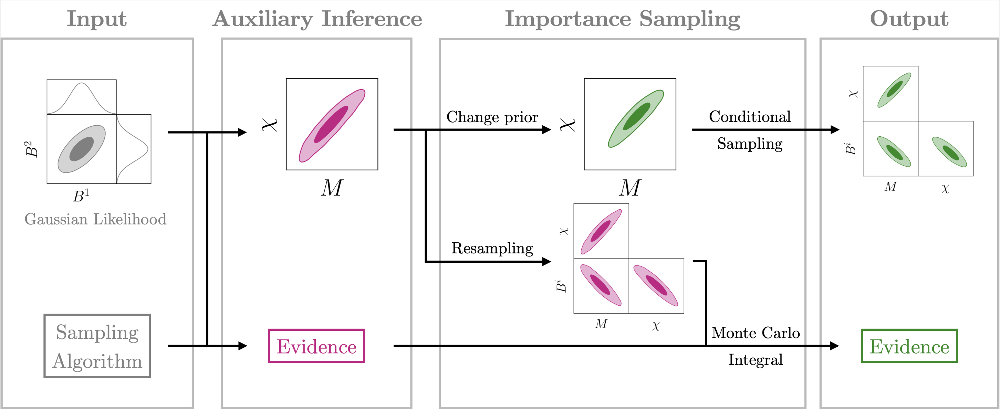

# Firefly-ringdown

--------------------------------------------------------------------

`Firefly-ringdown` is a Python program for accelerating the Bayesian analysis of ringdown signals involving multiple quasi-normal modes (QNMs), serving the ringdown signal analysis of future gravitational-wave detectors.

It implements the marginalization of the amplitude parameters under a freely chosen QNM amplitude prior, dramatically reducing computation time while maintaining high sampling quality.

### 🛠️ Development install

We recommend using conda to configure the environment; please run the following command in the terminal.

```sh
conda create -n firefly python=3.10.16
conda activate firefly
pip install -r requirements.txt
```

### 🚀 Quick start

Make sure that `firefly` is in your current operating path, run the following command in the terminal,

```sh
python -m firefly.cli.firefly_ringdown --config_path config/NR0305_221_firefly_config.yaml
```

For comparison with full-parameters estimation, run the following command in the terminal,

```sh
python -m firefly.cli.fullparams_ringdown --config_path config/NR0305_221_fullparams_config.yaml
```

We offer a script to compare posteriors of Firefly and full-parameter sampling, 
```sh
python -m firefly.cli.posterior_comparison --config_path config/posterior_comparison.yaml
```

### 💡 Algorithm

Based on the likelihood-driven importance-sampling scheme design, we extended the marginalization acceleration approach of the $\mathcal{F}$-statistic to arbitrary prior scenarios, significantly accelerating the computational efficiency of traditional full-parameter Bayesian inference.

<h1 align="center">

</h1>

### 🔗 Attribution

If you have used or referred to the code from `Firefly-ringdown`, please cite [Y. Dong &amp; Z. Wang et al. (2025)](https://arxiv.org/abs/2502.01093).

```bibtex
@article{Dong:2025igh,
    author = "Dong, Yiming and Wang, Ziming and Wang, Hai-Tian and Zhao, Junjie and Shao, Lijing",
    title = "{A practical Bayesian method for gravitational-wave ringdown analysis with multiple modes}",
    eprint = "2502.01093",
    archivePrefix = "arXiv",
    primaryClass = "gr-qc",
    month = "2",
    year = "2025"
}
```

### 🌟 Acknowledgement

We gratefully acknowledge the developers of the following gravitational-wave analysis libraries, which have been instrumental to this project, [bilby](https://github.com/bilby-dev/bilby), [pycbc](https://github.com/gwastro/pycbc), [lalsuite](https://lscsoft.docs.ligo.org/lalsuite/lalsuite/), [qnm](https://github.com/duetosymmetry/qnm), [gwpy](https://gitlab.com/gwpy/gwpy) and [pykerr](https://github.com/cdcapano/pykerr).

We gratefully acknowledge the following papers, upon whose theoretical foundations the Firefly methodology is built.

- [M. Isi & W. M. Farr (2021)](https://arxiv.org/abs/2107.05609)
- [H.-T. Wang et al. (2024)](https://arxiv.org/abs/2409.00970)

