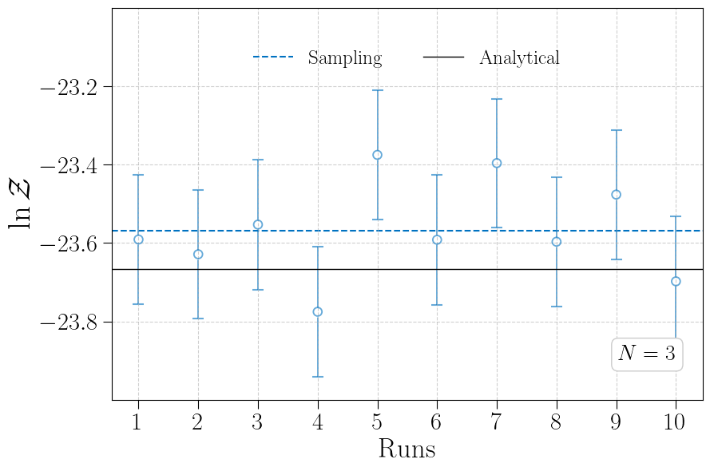

# Evidence Test

---------------------------------

### Motivation

We noticed that the evidences estimated by Firefly is slightly lower than those of full-parameter sampling (see Figure 4 in [Firefly](https://arxiv.org/abs/2502.01093)). Similar behavior has been reported for other importance sampling-based evidence estimate method (see Table 1 of  [DINGO-IS](https://arxiv.org/abs/2210.05686)). In these studies, although importance sampling typically yields low-variance estimates, its evidence estimates are consistently lower those from full-parameter sampling. In principle, importance sampling should be unbiased. We investige this discrepancy and offer an explanation here.

---------------------------------

### Validation Methodology

To investigate the discrepancy, we simulate how Firefly and full-parameter sampling compute the marginal integral over the amplitude–phase parameter space. 

We begin by applying nested sampling to compute the evidence (i.e., the integral) of a Gaussian function, whose true value is known analytically. Since in amplitude–phase parameter space, the likelihood function is Gaussian under quadrature amplitude parameterization (i.e., the $\bm{B}$ parameterization in [Firefly](https://arxiv.org/abs/2502.01093)). Firefly computes the marginal integral over the amplitude–phase parameter space analytically via explicit marginalization, whereas full-parameter sampling estimates the same integral by numerically exploring that space with nested sampling. In this framework, we aim to verify whether numerical exploration of the amplitude–phase parameter space can faithfully reproduce the closed-form analytic result.

The Gaussian function chosen here is defined by the Fisher information matrix evaluated around the true values in overtone analysis. It should be highly representative in evidence calculation.

Here we provide a script that runs all validation steps in one go. It contains,

- Computing the Fisher information matrix,
- Performing nested sampling to estimate the evidence of this Gaussian function ten times,
- Collecting the results, and producing the final plot.

Ensure that the current working directory is the `Firefly-ringdown` folder, run the script,
```sh
chmod +x docs/tests/evidence-test/run_evidence_test.sh
docs/tests/evidence-test/run_evidence_test.sh 223
```
Simply replace `223` with `221` or `222` in the argument to validate the evidence calculation under different parameter-space dimensions. If your setup differs, you can manually edit the `run_evidence_test.sh` script to activate the appropriate Conda environment.

---------------------------------

### Step-by-step Workflow

Here we also provide a detailed, step-by-step validation workflow.

#### Fisher Information Matrix

Ensure that the current working directory is the `Firefly-ringdown` folder, run the script, run
```sh
export PYTHONPATH="${PYTHONPATH}:$PWD"
python docs/tests/evidence-test/fisher_matrix_calculations.py --config_path config/ZeroNoise_223_firefly_config.yaml
```
This will compute the Fisher information matrix and its analytic integral, saving the results to `results/evidence-test`.

- Vary the case by simply swapping out the config file: `config/ZeroNoise_221_firefly_config.yaml` / `config/ZeroNoise_222_firefly_config.yaml`

#### Nested Sampling Evidence Estimation 

Next, we apply nested sampling to the amplitude–phase parameter space to estimate the evidence,
```sh
python docs/tests/evidence-test/fullparams_evidence_test.py --lmns 223 --version 0
```
- Vary the case by replacing `--lmns 223` with `--lmns 221` or `--lmns 222`
- Repeat runs by incrementing the `--version` flag

#### Results Aggregation and Plotting

Once you have completed the nested‐sampling runs, use the provided summary script to collect the estimated evidence and generate the final plot,
```sh
python docs/tests/evidence-test/summary.py --lmns 223
```
- Vary the case by replacing `--lmns 223` with `--lmns 221` or `--lmns 222`

---------------------------------

### Conclusion

Here we present the results of `lmns=223` under nested-sampling setting of `nlive=2000`. It is clear that the evidence estimates from full-parameter sampling is slightly higher than the closed-form analytic result. To some extent, it explain why importance sampling-based evidence estimators yield lower values. **It may stem from insufficient exploration of low-likelihood regions of the parameter space, which can lead full-parameter sampling to overestimate the evidence.**

Moreover, merely tuning nested-sampling settings does not fully resolve the issue. For example, increasing the number of live points (`nlive`) dramatically raises the computational cost of parameter estimation.

<h1 align="center">

</h1>


